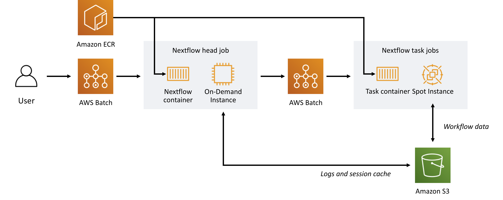

# Nextflow on AWS

## Overview

The amount of genomic sequence data has exponentially increased year over year since the introduction of NextGen Sequencing nearly a decade ago.  While traditionally this data was processed using on-premise computing clusters, the scale of recent datasets, and the processing throughput needed for clinical sequencing applications can easily exceed the capabilities and availability of such hardware.  In contrast, the cloud offers unlimited computing resources that can be leveraged for highly efficient, performant, and cost effective genomics analysis workloads.

Nextflow is a highly scalable reactive open source workflow framework that runs on infrastructure ranging from personal laptops, on-premise HPC clusters, and in the cloud using services like AWS Batch - a fully managed batch processing service from Amazon Web Services.

This tutorial will walk you through how to setup AWS infrastructure and Nextflow to run genomics analysis pipelines in the cloud.  You will learn how to create AWS Batch Compute Environments and Job Queues that leverage Amazon EC2 Spot and On-Demand instances.  Using these resources, you will build architecture that runs Nextflow entirely on AWS Batch in a cost effective and scalable fashion.  You will also learn how to process large genomic datasets from Public and Private S3 Buckets. By the end of the session, you will have the resources you need to build a genomics workflow environment with Nextflow on AWS, both from scratch and using automated mechanisms like CloudFormation.

## Prerequisites

Attendees are expected to:

* have administrative access to an AWS Account
* be comfortable using the Linux command line (e.g. using the `bash` shell)
* be comfortable with Git version control at the command line
* have familiarity with the AWS CLI
* have familiarity with Docker based software containers
* have familiarity with genomics data formats such as FASTQ, BAM, and VCF
* have familiarity with genomics secondary analysis steps and tooling
* have familiarity with Nextflow and its domain specific workflow language

## Downloads

[re:Invent 2019 - CMP412 session slides](./downloads/reInvent-2019_CMP412_genomics-pipelines-nextflow.pdf)