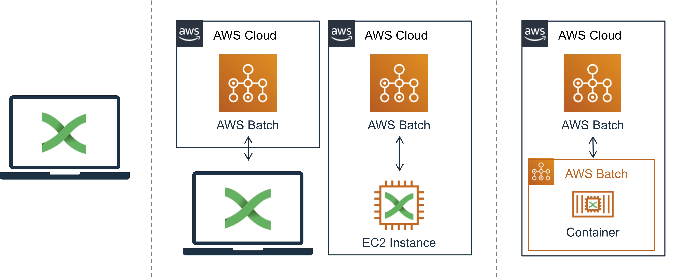
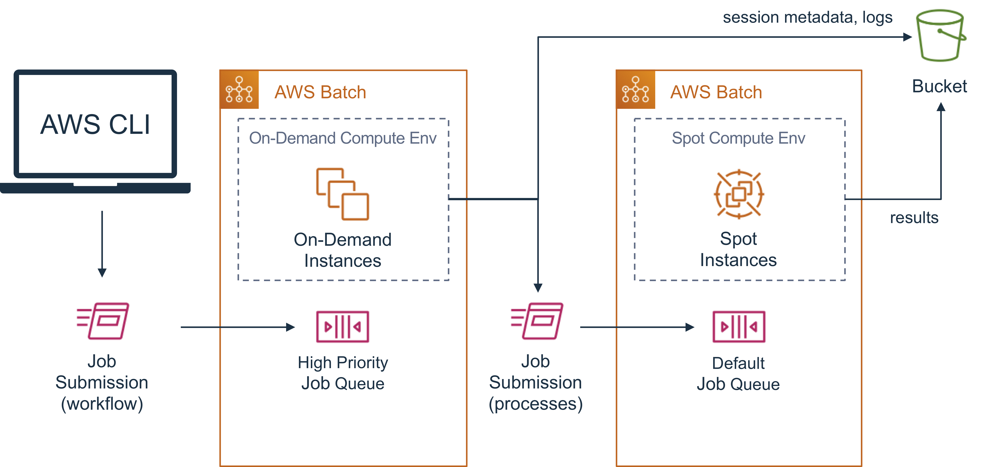

# Module 2 - Running Nextflow

There are a couple key ways to run Nextflow:

*  locally for both the master process and jobs
*  locally for the master process with AWS Batch for jobs
*  containerized with "Batch-Squared" Infrastructure - An AWS Batch job for the master process that creates additional AWS Batch jobs



## Local master and jobs

You can run Nextflow workflows entire on a single compute instance.  This can either be your local laptop, or a remote server like an EC2 instance.  in this workshop, your AWS Cloud9 Environment can simulate this scenario.

In a bash terminal, type the following:

```bash
nextflow run hello
```

This will run Nextflow's built-in "hello world" workflow.

## Local master and AWS Batch jobs

Genomics and life sciences workflows typically use a variety of tools that each have distinct computing resource requirements, such as high CPU or RAM utilization, or GPU acceleration.
Sometimes these requirements are beyond what a laptop or a single EC2 instance can provide.  Plus, provisioning a single large instance so that a couple of steps in a workflow can run would be a waste of computing resources.

A more cost effective method is to provision compute resources dynamically, as they are needed for each step of the workflow.
This is what AWS Batch is good at doing.

Here we'll use the AWS Resources that were created ahead of time in your account.  (These match the resources described in [Module 1](./module-2__aws-resources).

To configure your local Nextflow installation to use AWS Batch for workflow steps (aka jobs, or processes) you'll need to know the following:

* The "default" AWS Batch Job Queue workflows will be submitted to
* The S3 path that will be used as your nextflow working directory

These parameters need to go into a Nextflow config file.
To create this file, open a bash terminal and run the following:

```bash
cd ~/environment
mkdir -p work

cd ~/environment/work
python ~/environment/nextflow-workshop/create-config.py > nextflow.config
```  

This will create a file called `~/environment/work/nextflow.config` with contents like the following:

```groovy
workDir = "s3://genomics-workflows-cfa71800-c83f-11e9-8cd7-0ae846f1e916/_nextflow/runs"
process.executor = "awsbatch"
process.queue = "arn:aws:batch:us-west-2:123456789012:job-queue/default-45e553b0-c840-11e9-bb02-02c3ece5f9fa"
aws.batch.cliPath = "/home/ec2-user/miniconda/bin/aws"
```

Now when your run the `nextflow` "hello world" example from within this `work` folder:

```bash
cd ~/environment/work
nextflow run hello
```

you should see the following output:

```text
N E X T F L O W  ~  version 19.07.0
Launching `nextflow-io/hello` [angry_heisenberg] - revision: a9012339ce [master]
WARN: The use of `echo` method is deprecated
executor >  awsbatch (4)
[54/5481e0] process > sayHello (4) [100%] 4 of 4 ✔
Hello world!

Ciao world!

Bonjour world!

Hola world!

Completed at: 12-Sep-2019 00:46:56
Duration    : 3m 1s
CPU hours   : (a few seconds)
Succeeded   : 4
```

This will be similar to the output in the previous section with the only difference being:

```
executor >  awsbatch (4)
```

which indicates that workflow processes were run remotely as AWS Batch Jobs and not on the local instance.

## Batch-Squared



Since the master `nextflow` process needs to be connected to jobs to monitor progress, using a local laptop, or a dedicated EC2 instance for the master `nextflow` process is not ideal for long running workflows.  In both cases, you need to make sure that the machine or EC2 instance stays on for the duration of the workflow, and is shutdown when the workflow is complete.  If a workflow finishes in the middle of the night, it could be hours before the instance is turned off.

The `nextflow` executable is fairly lightweight and can be easily containerized.  After doing so, you can then submit a job to AWS Batch that runs `nextflow`.  This job will function as the master `nextflow` process and submit additional AWS Batch jobs for the workflow.  Hence, this is AWS Batch running AWS Batch, or Batch-squared!

The benefit of Nextflow on Batch-squared is that since AWS Batch is managing the compute resources for both the master `nextflow` process _and_ the workflow jobs, once the workflow is complete, everything is automatically shut-down for you.

The next two sub-sections walk through how to containerize Nextflow and create an AWS Batch Job Definition to run the container.  These resources have already been created in your account for the workshop.

### Containerizing Nextflow

Here, we'll create a `nextflow` Docker container and push the container image to a repository in Amazon Elastic Container Registry (ECR).  As part of the containerization process, we'll add an entrypoint script that will make the container "executable" and enable extra integration with AWS.

In your AWS Cloud9 environment navigate to the `nextflow-workshop` folder.  There you will find the following files:

* `Dockerfile`
* `nextflow.aws.sh`

If you do not see these files, create them with the following contents:

#### `Dockerfile`

Since the latest release of `nextflow` can be downloaded as a precompiled executable, the Dockerfile to create a container image is fairly straight-forward and replicates the steps you would do to install `nextflow` on a local system.

```Dockerfile
FROM centos:7 AS build

RUN yum update -y \
 && yum install -y \
    curl \
    java-1.8.0-openjdk \
    awscli \
 && yum clean -y all

ENV JAVA_HOME /usr/lib/jvm/jre-openjdk/

WORKDIR /opt/inst
RUN curl -s https://get.nextflow.io | bash
RUN mv nextflow /usr/local/bin

COPY nextflow.aws.sh /opt/bin/nextflow.aws.sh
RUN chmod +x /opt/bin/nextflow.aws.sh

WORKDIR /opt/work
ENTRYPOINT ["/opt/bin/nextflow.aws.sh"]
```

#### `nextflow.aws.sh`

```bash
#!/bin/bash
# $1    Nextflow project. Can be an S3 URI, or git repo name.
# $2..  Additional parameters passed on to the nextflow cli

# using nextflow needs the following locations/directories provided as
# environment variables to the container
#  * NF_LOGSDIR: where caching and logging data are stored
#  * NF_WORKDIR: where intermmediate results are stored


echo "$@"
NEXTFLOW_PROJECT=$1
shift
NEXTFLOW_PARAMS="$@"

# Create the default config using environment variables
# passed into the container
NF_CONFIG=~/.nextflow/config

cat << EOF > $NF_CONFIG
workDir = "$NF_WORKDIR"
process.executor = "awsbatch"
process.queue = "$NF_JOB_QUEUE"
aws.batch.cliPath = "/home/ec2-user/miniconda/bin/aws"
EOF

# AWS Batch places multiple jobs on an instance
# To avoid file path clobbering use the JobID and JobAttempt
# to create a unique path
GUID="$AWS_BATCH_JOB_ID/$AWS_BATCH_JOB_ATTEMPT"

if [ "$GUID" = "/" ]; then
    GUID=`date | md5sum | cut -d " " -f 1`
fi

mkdir -p /opt/work/$GUID
cd /opt/work/$GUID

# stage in session cache
# .nextflow directory holds all session information for the current and past runs.
# it should be `sync`'d with an s3 uri, so that runs from previous sessions can be 
# resumed
aws s3 sync --only-show-errors $NF_LOGSDIR/.nextflow .nextflow

# stage workflow definition
if [[ "$NEXTFLOW_PROJECT" =~ "^s3://.*" ]]; then
    aws s3 sync --only-show-errors --exclude 'runs/*' --exclude '.*' $NEXTFLOW_PROJECT ./project
    NEXTFLOW_PROJECT=./project
fi

echo "== Running Workflow =="
echo "nextflow run $NEXTFLOW_PROJECT $NEXTFLOW_PARAMS"
nextflow run $NEXTFLOW_PROJECT $NEXTFLOW_PARAMS

# stage out session cache
aws s3 sync --only-show-errors .nextflow $NF_LOGSDIR/.nextflow

# .nextflow.log file has more detailed logging from the workflow run and is
# nominally unique per run.
#
# when run locally, .nextflow.logs are automatically rotated
# when syncing to S3 uniquely identify logs by the batch GUID
aws s3 cp --only-show-errors .nextflow.log $NF_LOGSDIR/.nextflow.log.${GUID/\//.}
```

The entrypoint script does a couple of extra things:

1. It stages `nextflow` session and logging data to S3.  This is important since, running as a container on AWS Batch, this data will be deleted when the container process finishes.  Syncing this data to S3 enables use of the `-resume` flag with `nextflow`.
2. It also enables projects to be specified as an S3 URI - i.e. a bucket and folder therein where you have staged your Nextflow scripts and supporting files.

To build the container, open a bash terminal in AWS Cloud9, `cd` to the directory where the `Dockerfile` and `nextflow.aws.sh` files are and run the following command:

```bash
cd ~/environment/nextflow-workshop
docker build -t nextflow .
```

This will take about 2-3min to complete.

To push the container image to Amazon ECR:

* Create an image repository in Amazon ECR:
  
  * Go to the Amazon ECR Console
  * Do one of:
    * Click on "Get Started"
    * Expand the hamburger menu and click on "Repositories" and click on "Create Repository"
  * For repository name type
    * "mynextflow" - if you are attending an in person workshop
    * "nextflow" - if you are doing this on your own
  * Click "Create Repository"

* Push the container image to ECR
  
  * Go to the Amazon ECR Console
  * Type the name of your repository (e.g. "nextflow") into the search field
  * Select the repository
  * Click on "View Push Commands"
  * Follow the instructions in the dialog that appears in a bash console in AWS Cloud9


### Batch Job Definition for Nextflow

To run `nextflow` as and AWS Batch job, you'll need a Batch Job Definition.  This needs to reference the following:

* the `nextflow` container image
* the S3 URI used for nextflow logs and session cache
* the S3 URI used as a nextflow `workDir`
* an IAM role for the Job that allows it to call AWS Batch and write to the S3 bucket(s) referenced above

First, create the IAM role for the job:

* Go to the IAM Console

Create a policy that allows the `nextflow` job to call AWS Batch, read-only access to all available / public S3 buckets, and write access **only** to the S3 buckets you will use for logs and workDir.

* Click on "Policies"
* Click "Create Policy"
* Select "Batch" as the service
* Under Actions > Access level:
  * Check all "List"
  * Check all "Read"
  * Under "Write" select:
    * CancelJob
    * TerminateJob
    * SubmitJob
    * DeregisterJobDefinition
    * RegisterJobDefinition
* Under Resources select "All Resources"
* Click "Review Policy"
* Name the policy "nextflow-batch-access-policy"
* Click "Create Policy"

Create a service role:

* Click on "Roles"
* Click on "Create role"
* Select "AWS service" as the trusted entity
* Choose Elastic Container Service from the larger services list
* Choose "Elastic Container Service Task" as the use case.
* Click "Next: Permissions"
* Type "S3" in the search field
* Check the box next to "AmazonS3ReadOnlyAccess"

* Type "nextflow-batch-access-policy" in the search field
* Check the box next to "nextflow-batch-access-policy" (this is the policy you created above)

You'll also need to add the policies you created in [Module - 1](./module-2__aws-resources.md) > [IAM Roles](./module-2__aws-resources.md#iam-roles) > [Create IAM Policies](./module-2__aws-resources.md#create-an-iam-policies) for S3 bucket access and EBS autoscaling.

* Type "bucket-access-policy" in the search field
* Check the box next to "bucket-access-policy"

* Type "nextflow-batch-access-policy" in the search field
* Check the box next to "ebs-autoscale-policy"

* Click "Next: Tags".  (adding tags is optional)
* Click "Next: Review"
* Set the Role Name to "NextflowJobRole"
* Click "Create role"

Now we have everything we need in place to create the Batch Job Definition.

* Go to the AWS Batch Console
* Click on "Job Definitions"
* Click on "Create"
* In "Job definition name", type "nextflow"
* In the "Job role" menu, select the NextflowJobRole you created above
* In "Container image", type the URI for the `nextflow` container image in ECR.
  * It should look something like: `123456789012.dkr.ecr.{region}.amazonaws.com/nextflow:latest`
* Set vCPUs = 2
* Set Memory (MiB) = 1024
* Click on "Add environment variable" and set:
  * Key = "NF_LOGSDIR"
  * Value = "s3://nextflow-workshop-abc-20190101/_nextflow/logs"
* Repeat the above for:
  * "NF_WORKDIR"="s3://nextflow-workshop-abc-20190101/_nextflow/logs"
  * "NF_JOB_QUEUE"="default-job-queue"
* Click "Create Job Definition"

### Submitting a Nextflow workflow

To submit a Nextflow workflow - e.g. the `nextflow` "hello" workflow to the Batch-squared architecture:

* Go to the AWS Batch Console
* Click "Jobs"
* Click "Submit job"
* Set "Job name" as "nf-workflow-hello"
* For "Job definition" select "nextflow:1"
* For "Job queue" select "highpriority".  It is important that the `nextflow` master process not be interrupted for the duration of the workflow.
* In the "Command" field type "hello".  Text here is the same as what would be sent as `...` arguments to a `docker run -it nextflow ...` command.
* Click "Submit job"

To monitor the status of the workflow:

* Go to the AWS Batch Console
* Click on "Dashboard"

You should see 1 job advance from "SUBMITTED" to "RUNNING" in the "highpriority" queue row.

Once the job enters the "RUNNING" state, you should see 4 additional jobs get submitted to the "default" queue.  These are the processes defined in the workflow.

When jobs are complete (either FAILED or SUCCEEDED) you can check the logs generated.

You can also use the AWS CLI to submit workflows.  For example, to run the `nextflow` "hello" workflow, type the following into a bash terminal:

```bash
aws batch submit-job \
  --job-definition nextflow \
  --job-name nf-workflow-hello \
  --job-queue highpriority \
  --container-overrides command=hello
```

You should get a response like:

```json
{
    "jobName": "nf-workflow-hello", 
    "jobId": "93e2b96e-9bee-4d67-b935-d31d2c12173a"
}
```

which contains the AWS Batch JobId you can use to track progress of the workflow.  To do this, you can use the Jobs view in the AWS Batch Console.

You can also simplify the command by wrapping it in a bash script that gather's key information automatically.

```bash
#!/bin/bash

# Helper script for submitting nextflow workflows to Batch-squared architecture
# Workflows are submitted to the first "highpriority" Batch Job Queue found in
# in the default AWS region configured for the user.
#
# Usage:
# submit-workflow.sh WORKFLOW_NAME (file://OVERRIDES_JSON | (CONTAINER_ARGS ...))
#
# Examples:
# submit-workflow.sh hello file://hello.overrides.json
# submit-workflow.sh hello hello

WORKFLOW_NAME=$1  # custom name for workflow
shift
PARAMS=("$@")     # args or path to json file for job overrides, e.g. file://path/to/overrides.json

# assume that the default region is set as a global environment variable
# alternatively get it using `aws configure get default.region`
if [ -z "$AWS_REGION" ]; then
    AWS_REGION=`aws configure get default.region`
fi

if [[ ${PARAMS[0]} == file://* ]]; then
    # user provided a file path to an overrides json
    # shift remaining args
    OVERRIDES=${PARAMS[0]}
    shift
else
    # construct a comma separated list for shorthand overrides notation
    OVERRIDES=$(printf "'%s'," ${PARAMS[@]})
    OVERRIDES="command=${OVERRIDES%,}"
fi

# get the name of the high-priority queue
HIGHPRIORITY_JOB_QUEUE=$(aws --region $AWS_REGION batch describe-job-queues | jq -r .jobQueues[].jobQueueName | grep highpriority)

if [ -z "$HIGHPRIORITY_JOB_QUEUE" ]; then
    echo "no highpriority job queue found"
    exit 1
fi

# submits nextflow workflow to AWS Batch
# command is printed to stdout for debugging
COMMAND=$(cat <<EOF
aws batch submit-job \
    --region $AWS_REGION \
    --job-definition nextflow \
    --job-name nf-workflow-${WORKFLOW_NAME} \
    --job-queue ${HIGHPRIORITY_JOB_QUEUE} \
    --container-overrides ${OVERRIDES}
EOF
)

echo $COMMAND
${COMMAND}
```

Output from this script would look like this:

```bash
./submit-workflow.sh hello hello

# aws batch submit-job --region us-west-2 --job-definition nextflow --job-name nf-workflow-hello --job-queue highpriority-45e553b0-c840-11e9-bb02-02c3ece5f9fa --container-overrides command='hello'
# {
#     "jobName": "nf-workflow-hello", 
#     "jobId": "ecb9a154-92a9-4b9f-99d5-f3071acb7768"
# }
```

### Run a realistic demo workflow

Here is the source code for a demo workflow that converts FASTQ files to VCF using bwa-mem, samtools, and bcftools.  It uses a public data set that has been trimmed and only calls variants on chromosome 21 so that the workflow completes in about 5-10 minutes.

https://github.com/wleepang/demo-genomics-workflow-nextflow

To submit this workflow you can use the script you created above:

```bash
./submit-workflow.sh demo \
  wleepang/demo-genomics-workflow-nextflow \
  --output s3://nextflow-workshop-abc-20190101
```

!!! note
    You need to specify a bucket that you have write access to via the `--output` parameter.  Otherwise, the workflow will fail.

You can check the status of the workflow via the command line:

```bash
aws batch describe-jobs --jobs $jobid | jq -r .jobs[].status
```

You can also check the log output from the workflow:

* Go to the AWS Batch Console
* Click on "Jobs"
* Select the "highpriority" queue
* Click on "RUNNING" ()
* Click on the Job that matches the JobId above
* Scroll to the bottom of the Job Info and click on "View logs for the most recent attempt in the CloudWatch console".

You should now be in CloudWatch Logs looking at the log stream for the AWS Batch job running your nextflow workflow.

### Run an NF-Core wokflow

There are many example workflows available via [NF-Core](https://nf-core.re).  These are workflows that are developed using best practices from the Nextflow community.  They are also good starting points to run common analyses such as ATACSeq or RNASeq.

The steps below runs the nf-core/rnaseq workflow against data from the 1000 Genomes dataset.

You can do this directly from the command line with:

```bash
./submit-workflow.sh rnaseq \
  nf-core/rnaseq \
    --reads s3://1000genomes/phase3/data/HG00243/sequence_read/SRR*_{1,2}.filt.fastq.gz \
    --genome GRCh37 \
    --skip_qc
```

There are many parameters for this workflow, and setting all via the command line can be cumbersome.  For more complex configurations, it is best to package the container overrides into a JSON file.  To do this for the above workflow configuration:

Create a json file called `rnaseq.parameters.json` with the following contents:

```json
{
    "command": [
      "nf-core/rnaseq",
      "--reads", "s3://1000genomes/phase3/data/HG00243/sequence_read/SRR*_{1,2}.filt.fastq.gz",
      "--genome", "GRCh37",
      "--skip_qc"
    ]
}
```

Submit the workflow using:

```bash
./submit-workflow.sh rnaseq file://rnaseq.parameters.json
```

This workflow takes approximately 3hrs to complete.
