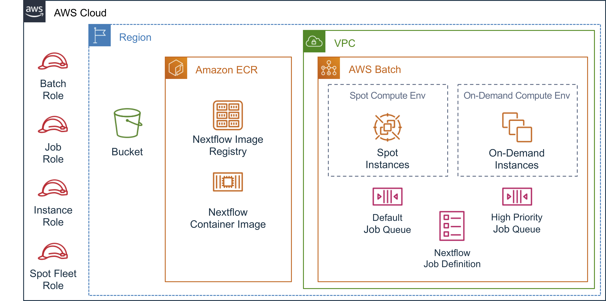

# Module 2 - AWS Resources



This module will cover building the core AWS resources you need to run Nextflow on AWS from scratch.

If you are attending an in person workshop, these resources have been created ahead of time in the AWS accounts you were provided.  During the workshop we'll walk through all the pieces of the architecture at a high level so you know how everything is wired together.

## S3 Bucket

You'll need an S3 bucket to store both your input data and workflow results.
S3 is an ideal location to store datasets of the size encountered in genomics, 
which often equal or exceed 100GB per sample file.

S3 also makes it easy to collaboratively work on such large datasets because buckets
and the data stored in them are globally available.

* Go to the S3 Console
* Click on the "Create Bucket" button

In the dialog that opens:

* Provide a "Bucket Name".  This needs to be globally unique.  A pattern that usually works is

```text
<workshop-name>-<your-initials>-<date>
```

for example:

```text
nextflow-workshop-abc-20190101
```

* Select the region for the bucket.  Buckets are globally accessible, but the data resides on physical hardware with in a specific region.  It is best to choose a region that is closest to where you are and where you will launch compute resources to reduce network latency and avoid inter-region transfer costs.

The default options for bucket configuration are sufficient for the purposes of this workshop.

* Click the "Create" button to accept defaults and create the bucket.


## IAM Roles

IAM is used to control access to your AWS resources.  This includes access by users and groups in your account, as well as access by AWS services operating on your behalf.

Services use IAM Roles which provide temporary access to AWS resources when needed.

!!! danger "Important"
    You need to have Administrative access to your AWS account to create IAM roles.

    A recommended way to do this is to create a user and add that user to a group
    with the `AdministratorAccess` managed policy attached.  This makes it easier to 
    revoke these privileges if necessary.

### Create a Batch Service Role

This is a role used by AWS Batch to launch EC2 instances on your behalf.

* Go to the IAM Console
* Click on "Roles"
* Click on "Create role"
* Select "AWS service" as the trusted entity
* Choose "Batch" as the service to use the role
* Click "Next: Permissions"

In Attached permissions policies, the "AWSBatchServiceRole" will already be attached

* Click "Next: Tags".  (adding tags is optional)
* Click "Next: Review"
* Set the Role Name to "AWSBatchServiceRole"
* Click "Create role"


### Create an EC2 SpotFleet Role

This is a role that allows creation and launch of Spot fleets - Spot instances with similar compute capabilities (i.e. vCPUs and RAM).  This is for using Spot instances when running jobs in AWS Batch.

* Go to the IAM Console
* Click on "Roles"
* Click on "Create role"
* Select "AWS service" as the trusted entity
* Choose EC2 from the larger services list
* Choose "EC2 - Spot Fleet Tagging" as the use case

In Attached permissions policies, the "AmazonEC2SpotFleetTaggingRole" will already be attached

* Click "Next: Tags".  (adding tags is optional)
* Click "Next: Review"
* Set the Role Name to "AWSSpotFleetTaggingRole"
* Click "Create role"


### Create IAM Policies

For the EC2 instance role in the next section, it is recommended to restrict access to just the resources and permissions it needs to use.  In this case, it will be:

* Access to the specific bucket(s) used for input and output data
* The ability to create and add EBS volumes to the instance (more on this later)

These policies could be used by other roles, so it will be easier to manage if it each are stand alone documents.

#### Bucket access policy

!!! info
    If you already created this policy in [Module 1 - Running Nextflow](./module-1__running-nextflow.md) you can skip this creating this policy

* Go to the IAM Console
* Click on "Policies"
* Click on "Create Policy"
* Repeat the following for as many buckets as you will use (e.g. if you have one bucket for nextflow logs and another for nextflow workDir, you will need to do this twice)
    * Select "S3" as the service
    * Select "All Actions"
    * Under Resources select "Specific"
    * Under Resources > bucket, click "Add ARN"
        * Type in the name of the bucket
        * Click "Add"
    * Under Resources > object, click "Add ARN"
        * For "Bucket Name", type in the name of the bucket
        * For "Object Name", select "Any"
    * Click "Add additional permissions" if you have additional buckets you are using
* Click "Review Policy"
* Name the policy "bucket-access-policy"
* Click "Create Policy"

#### EBS volume policy

* Go to the IAM Console
* Click on "Policies"
* Click on "Create Policy"
* Switch to the "JSON" tab
* Paste the following into the editor:

```json
{
    "Version": "2012-10-17",
    "Statement": {
        "Action": [
            "ec2:createVolume",
            "ec2:attachVolume",
            "ec2:deleteVolume",
            "ec2:modifyInstanceAttribute",
            "ec2:describeVolumes"
        ],
        "Resource": "*",
        "Effect": "Allow"
    }
}
```

* Click "Review Policy"
* Name the policy "ebs-autoscale-policy"
* Click "Create Policy"


### Create an EC2 Instance Role

This is a role that controls what AWS Resources EC2 instances launched by AWS Batch have access to.
In this case, you will limit S3 access to just the bucket you created earlier.

* Go to the IAM Console
* Click on "Roles"
* Click on "Create role"
* Select "AWS service" as the trusted entity
* Choose EC2 from the larger services list
* Choose "EC2 - Allows EC2 instances to call AWS services on your behalf" as the use case.
* Click "Next: Permissions"

* Type "ContainerService" in the search field for policies
* Click the checkbox next to "AmazonEC2ContainerServiceforEC2Role" to attach the policy

* Return to the search field, clear its content, and type "S3" to search for additional policies for this role
* Click the checkbox next to "AmazonS3ReadOnlyAccess" to attach the policy

!!! note
    Enabling Read-Only access to all S3 resources is required if you use publicly available datasets such as the [1000 Genomes dataset](https://registry.opendata.aws/1000-genomes/), and others, available in the [AWS Registry of Open Datasets](https://registry.opendata.aws)

* Repeat this process and type "bucket-access-policy" in the search field for policies
* Click the checkbox next to "bucket-access-policy" you created in the previous steps to attach the policy

* Lastly, type "ebs-autoscale-policy" in the search field for policies
* Click the checkbox next to "ebs-autoscale-policy" you created in the previous steps to attach the policy

* Click "Next: Tags".  (adding tags is optional)
* Click "Next: Review"
* Set the Role Name to "ecsInstanceRole"
* Click "Create role"


## EC2 Launch Template

An EC2 Launch Template is used to predefine EC2 instance configuration options such as Amazon Machine Image (AMI), Security Groups, and EBS volumes.  They can also be used to define User Data scripts to provision instances when they boot.  This is simpler than creating (and maintaining) a custom AMI in cases where the provisioning requirements are simple (e.g. addition of small software utilities) but potentially changing often with new versions.

AWS Batch supports both custom AMIs and EC2 Launch Templates as methods to bootstrap EC2 instances launched for job execution.

* Go to the EC2 Console
* Click on "Launch Templates" (under "Instances")
* Click on "Create launch template"
* Under "Launch template name and description"

    * Use "genomics-workflow-template" for "Launch template name"
    * (Optional) Add a description for the template like "launch template for nextflow genomics workflow instances"
    * Under "Template tags" add the following:

        * Key: "architecture", Value: "genomics-workflow"
        * Key: "solution", Value: "nextflow"
  
* Under "Amazon machine image (AMI)"
  
    * Type "**amzn-ami-2018.03.y-amazon-ecs-optimized**" in the search field and hit <kbd>enter</kbd>.  Wait for the results to populate (this may take a couple seconds).  You should see one entry available under the "Community AMIs" section - this will be the Amazon ECS Optimized AMI for your current region.

!!! note
    For faster results, you can specify the AMI-Id directly.  You can look up the specific AMI-Id for your region [here](https://docs.aws.amazon.com/AmazonECS/latest/developerguide/ecs-optimized_AMI.html).

!!! warning "Amazon Linux Version"
    The tooling for this solution currently only supports Amazon Linux 1.  Make sure you select the correct version of the Amazon ECS Optimized AMI that is based on Amazon Linux 2.

* Under "Storage volumes"
  
    * Click "Add new volume" - this will add an entry called "Volume 3 (custom)"
        * Set **Size** to **100 GiB**
        * Set **Delete on termination** to **Yes**
        * Set **Device name** to **/dev/sdc**
        * Set **Volume type** to **General purpose SSD (gp2)**
        * Set **Encrypted** to **Yes** 

!!! info
    **Volume 1** is used for the root filesystem.  The default size of 8GB is typically sufficient.

    **Volume 2** is used for the Docker image and metadata volume.  This is where Docker will store container images.  If you will be using large images, it is recommended to increase the size of this volume.

    **Volume 3** (the one you created above) will be used for job scratch space.  This will be mapped to `/var/lib/docker` which is used for container storage - i.e. what each running container will use to create its internal filesystem.

* Under "Instance tags"

    * Add the following:
        * Key: "architecture", Value: "genomics-workflow"
        * Key: "solution", Value: "nextflow"

* Expand the "Advanced details" section

    * Add the following script to **User data**


```yaml
MIME-Version: 1.0
Content-Type: multipart/mixed; boundary="==BOUNDARY=="

--==BOUNDARY==
Content-Type: text/cloud-config; charset="us-ascii"

packages:
- jq
- btrfs-progs
- python27-pip
- sed
- wget

runcmd:
- pip install -U awscli boto3
- scratchPath="/var/lib/docker"
- artifactRootUrl="https://s3.amazonaws.com/aws-genomics-workflows/artifacts"
- stop ecs
- service docker stop
- cp -au /var/lib/docker /var/lib/docker.bk
- rm -rf /var/lib/docker/*
- cd /opt && wget $artifactRootUrl/aws-ebs-autoscale.tgz && tar -xzf aws-ebs-autoscale.tgz
- sh /opt/ebs-autoscale/bin/init-ebs-autoscale.sh $scratchPath /dev/sdc  2>&1 > /var/log/init-ebs-autoscale.log
- sed -i 's+OPTIONS=.*+OPTIONS="--storage-driver btrfs"+g' /etc/sysconfig/docker-storage
- cp -au /var/lib/docker.bk/* /var/lib/docker
- cd /opt && wget $artifactRootUrl/aws-ecs-additions.tgz && tar -xzf aws-ecs-additions.tgz
- sh /opt/ecs-additions/ecs-additions-nextflow.sh 
- service docker start
- start ecs

--==BOUNDARY==--
```

* Click on "Create launch template"

The script used for User data installs a daemon called `aws-ebs-autoscale` which will create a BTRFS filesystem at a specified mount point, spread it across multiple EBS volumes, and add more volumes to ensure availability of disk space.

In this case, the mount point for auto expanding EBS volumes is set to `/var/lib/docker` - the location used for docker container storage volumes.  This allows for containers used in the workflow to stage in as much data as they need without needing to bind mount a special location on the host.

The above is used to handle the unpredictable sizes of data files encountered in genomics workflows, which can range from 10s of MBs to 100s of GBs.

In addition, the launch template installs the AWS CLI via `conda`, which is used by `nextflow` to stage input and output data.

## Batch Compute Environments

AWS Batch compute environments are groupings of EC2 instance types that jobs are scheduled onto based on their individual compute resource needs.  From an HPC perspective, you can think of compute environments like a virtual cluster of compute nodes.  Compute environments can be based on either On-demand or Spot EC2 instances, where the latter enables significant savings.

You can create several compute environments to suit your needs.  Below we'll create the following:

* An "optimal" compute environment using on-demand instances
* An "optimal" compute environment using spot instances


### Create an "optimal" on-demand compute environment

1. Go to the AWS Batch Console. If you have not used Batch before in this account, click on the "Get Started" button to start the wizard, then scroll to the end of the Define Job page and click the "Cancel" button. 
2. Click on "Compute environments".
3. Click on "Create environment"
4. Select "Managed" as the "Compute environment type"
5. For "Compute environment name" type: "ondemand"
6. In the "Service role" drop down, select the `AWSBatchServiceRole` you created previously
7. In the "Instance role" drop down, select the `ecsInstanceRole` you created previously
8. For "Provisioning model" select "On-Demand"
9. "Allowed instance types" will be already populated with "optimal" - which is a mixture of M4, C4, and R4 instances.
10. In the "Launch template" drop down, select the `genomics-workflow-template` you created previously
11. Set Minimum and Desired vCPUs to 0.

    !!! info
        **Minimum vCPUs** is the lowest number of active vCPUs (i.e. instances) your compute environment will keep running and available for placing jobs when there are no jobs queued.  Setting this to 0 means that AWS Batch will terminate all instances when all queued jobs are complete.

        **Desired vCPUs** is the number of active vCPUs (i.e. instances) that are currently needed in the compute environment to process queued jobs.  Setting this to 0 implies that there are currently no queued jobs.  AWS Batch will adjust this number based on the number of jobs queued and their resource requirements.

        **Maximum vCPUs** is the highest number of active vCPUs (i.e. instances) your compute environment will launch.  This places a limit on the number of jobs the compute environment can process in parallel.

12. For networking, the options are populated with your account's default VPC, public subnets, and security group.  This should be sufficient for the purposes of this workshop.  In a production setting, it is recommended to use a separate VPC, private subnets therein, and associated security groups.
13. Add EC2 tags. These will help us identify which EC2 instances were launched by AWS Batch. At minimum, type "Name" as the "Key" and "batch-ondemand-worker" as "Value".
  
Click on the "Create" button to start the process.

The Batch console will display the newly created "ondemand" environment with the "CREATING" status. We'll proceed with the next environment. 

### Create an "optimal" spot compute environment

1. Go to the AWS Batch Console
2. Click on "Compute environments" in the left sidebar
3. Click on "Create environment" button
4. Select "Managed" as the "Compute environment type"
5. For "Compute environment name" type: "spot"
6. In the "Service role" drop down, select the `AWSBatchServiceRole` you created previously
7. In the "Instance role" drop down, select the `ecsInstanceRole` you created previously
8. For "Provisioning model" select "Spot"
9. Verify that "Allowed instance types" is already populated with "optimal" - which is a mixture of M4, C4, and R4 instances
10. In the "Allocation strategy" drop down, select the "BEST_FIT" option to leverage the lowest priced instances available
11. In the "Spot fleet role" drop down, select the `AWSSpotFleetTaggingRole` you created previously
12. In the "Launch template" drop down, select the `genomics-workflow-template` you created previously
13. Set Minimum and Desired vCPUs to 0.
14. For networking, the options are pre-populated with your account's default VPC, public subnets, and security group.  This should be sufficient for the purposes of this workshop.  In a production setting, it is recommended to use a separate VPC, private subnets therein, and associated security groups.
15. Add EC tags. These will help us identify which EC2 instances were launched by AWS Batch. At minimum, type "Name" as the "Key" and "batch-spot-worker" as "Value".
  
Click on the "Create" button to start the process.

The Batch console will display both environments. At this time the "ondemand" should have a "VALID" status, whereas the "spot" environment will be listed as "CREATING". 

## Batch Job Queues

We will use AWS Batch job queues to submit and monitor the status of the jobs for this workshop. 
Job queues can be associated with one or more compute environments in a preferred order.
Multiple job queues can be associated with the same compute environment.  Thus to handle scheduling, job queues also have a priority weight as well.

Below we'll create two job queues:

* A "Default" job queue
* A "High Priority" job queue

Both job queues will use both compute environments you created previously.

### Create a "default" job queue

This queue is intended for jobs that do not require urgent completion, and can handle potential interruption.
Thus queue will schedule jobs to:

1. The "spot" compute environment
2. The "ondemand" compute environment

in that order.

Because it primarily leverages Spot instances, it will also be the most cost effective job queue.

* Go to the AWS Batch Console
* Click on "Job queues"
* Click on "Create queue"
* For "Queue name" use "default"
* Set "Priority" to 1
* Under "Connected compute environments for this queue", using the drop down menu:

    1. Select the "spot" compute environment you created previously, then
    2. Select the "ondemand" compute environment you created previously

* Make sure they are in the right order (1 - spot, 2 - ondemand). If you accidentally selected them in a different order, you can rearrange them using the arrows in the "Order" column.
* Click on "Create Job Queue"

### Create a "high-priority" job queue

This queue is intended for jobs that are urgent and **cannot** handle interruption.
Thus queue will schedule jobs to:

1. The "ondemand" compute environment
2. The "spot" compute environment

in that order.

* Go to the AWS Batch Console
* Click on "Job queues"
* Click on "Create queue"
* For "Queue name" use "highpriority"
* Set "Priority" to 100 (higher values mean higher priority)
* Under "Connected compute environments for this queue", using the drop down menu:

    1. Select the "ondemand" compute environment you created previously, then
    2. Select the "spot" compute environment you created previously

* This is similar with the "default" queue previously created, just that this time we have the environments in the reverse order.
* Click on "Create Job Queue"
